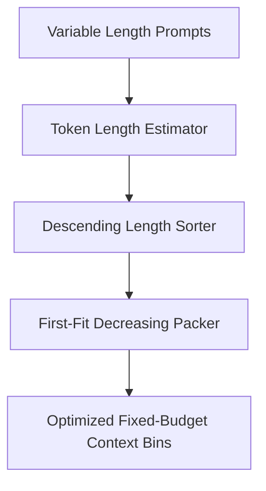

# genpark-prompt-token-length-budget-packager-skill

A First-Fit Decreasing (FFD) bin packing optimizer designed to maximize context window utilization during LLM fine-tuning and batch inference.

## Architecture

## Features
- **FFD Bin Packing**: Minimizes padding waste across fixed token windows (2k, 4k, 8k, 32k).
- **Utilization Analytics**: Calculates utilization rate and token waste per bin.
- **Pure Python Standard Library**: No external dependencies.
